HTerrain plugin documentation
===============================


Overview
----------

This plugin allows to create heightmap-based terrains in Godot Engine. This kind of terrain uses 2D images, such as for heights or texturing information, which makes it cheap to implement while covering most use cases, for high to low end GPUs.

It is entirely built on top of the `VisualServer` scripting API, which means it should be expected to work on both `GLES2` and `GLES3` backends.

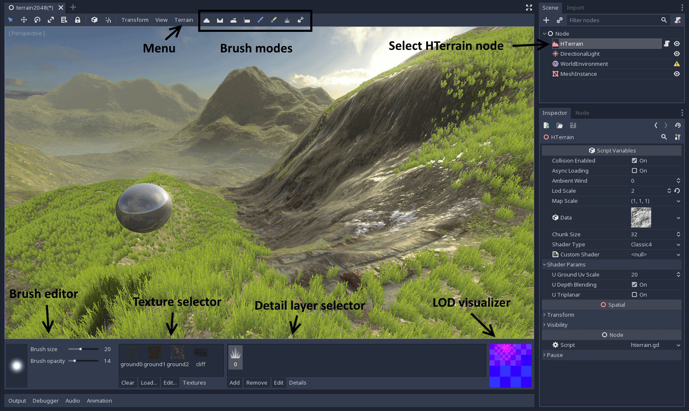


Creating a terrain
--------------------

### Creating a HTerrain node

Features of this plugin are mainly available from the `HTerrain` node. To create one, click the `+` icon at the top of the scene tree dock, and navigate to this node type to select it.

There is one last step until you can work on the terrain: you need to specify a folder in which all the data will be stored. The reason is that terrain data is very heavy, and it's a better idea to store it separately from the scene.
Select the `HTerrain` node, and click on the folder icon to choose that folder.

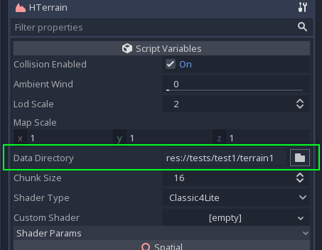

Once the folder is set, a default terrain should show up, ready to be edited.

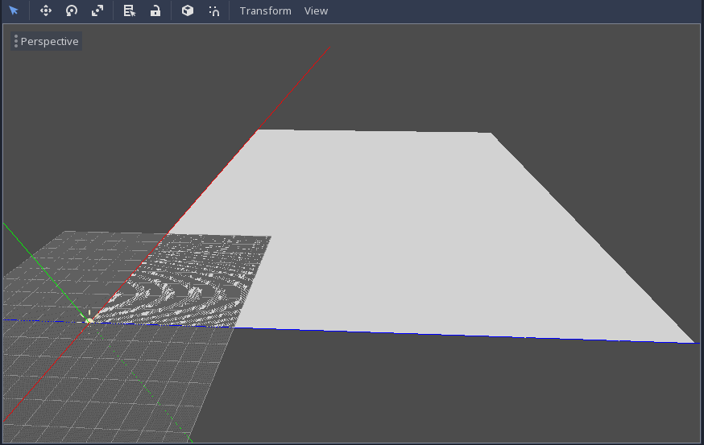

Note: if you don't have a default environment, it's possible that you won't see anything, so make sure you either have one, or add a light to the scene to see it. Also, because terrains are pretty large (513 units by default), it is handy to change the view distance of the editor camera so that you can see further: go to `View`, `Options`, and then increase `far distance`.

### Terrain dimensions

By default, the terrain is a bit small, so if you want to make it bigger, there are two ways:

- Modify `map_scale`, which will scale the ground without modifying the scale of all child nodes while using the same memory
- Use the `resize` tool in the `Terrain` menu, which will increase the resolution instead and take more memory.

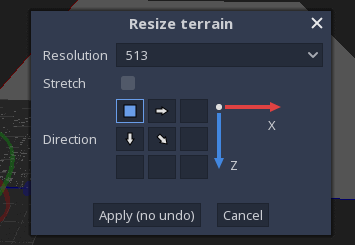

If you use the `resize` tool, you can also choose to either stretch the existing terrain, or crop it by selecting an anchor point. Note that currently, this operation is permanent and cannot be undone, so if you want to go back, you should make a backup.

Note: the resolution of the terrain is limited to powers of two + 1, mainly because of the way LOD was implemented. The reason why there is an extra 1 is down to the fact that to make 1 quad, you need 2x2 vertices. If you need LOD, you must have an even number of quads that you can divide by 2, and so on. However there is a possibility to tweak that in the future because this might not play well with the way older graphics cards store textures.

### Creating the terrain from script

You can also decide to create the terrain from a script. Here is an example:

```gdscript
extends Node

const HTerrain = preload("res://addons/zylann.hterrain/hterrain.gd")
const HTerrainData = preload("res://addons/zylann.hterrain/hterrain_data.gd")


func _ready():

	var data = HTerrainData.new()
	data.resize(513)
	
	var terrain = HTerrain.new()
	terrain.set_data(data)
	add_child(terrain)
```

It is also possible to generate the whole map by script, see [Procedural generation from a script](#procedural-generation-from-a-script).


Basic sculpting
------------------

### Using the brush

The default terrain is flat, but you may want to create hills and mountains. Because it uses a heightmap, editing this terrain is equivalent to editing an image. Because of this, the main tool is a brush with a configurable size and shape. You can see which area will be affected inside a 3D red circle appearing under your mouse, and you can choose how strong painting is by changing the `strength` slider.

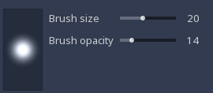

To modify the heightmap, you can use the following brush modes, available at the top of the viewport:


- **Raise**: raises the height of the terrain to produce hills
- **Lower**: digs down to create crevices
- **Smooth**: averages the heights within the radius of the brush
- **Flatten**: directly sets the height to a given value, which can be useful as an eraser or to make plateaux.

Note: heightmaps work best for hills and large mountains, but making sharp cliffs or walls are not recommended because it stretches geometry too much, and might cause edge cases with collisions. To make cliffs it's a better idea to place actual meshes on top.

### Normals

As you sculpt, the plugin automatically recomputes normals of the terrain, and saves it in a texture. This way, it can be used directly in ground shaders, grass shaders and previews at a smaller cost. Also, it allows to keep the same amount of details in the distance independently from geometry, which allows for levels of detail to work without affecting perceived quality too much.


Texturing
-----------

### Overview

Applying textures to terrains is a bit different than single models, because they are very large and a more optimal approach needs to be taken to keep memory and performance to an acceptable level. One very common way of doing it is by using a splatmap. A splatmap is another texture covering the whole terrain, where each channel R, G, B and A is a weight associated to a given texture. Those textures are then blended together using a shader.


There are many other techniques, notably involving texture arrays which should be worked on in the future to allow more different textures (it became available Godot 3.1). For now, this plugin only supports classic splatmaps, using `Classic4` and `Classic4Lite` shaders, which you can choose in the inspector. If you target less powerful GPUs, the `Lite` version is a bit cheaper by trading off a few features.

### Painting

Before you can paint, you have to set up ground textures. It is recommended to pick textures which can tile infinitely, and preferably use "organic" ones, because terrains are best-suited for exterior natural environments. You can find some of these textures for free at http://cc0textures.com.

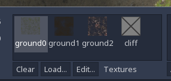

You will notice 4 slots for these, next to the brush settings, named `ground0`, `ground1`, `ground2` and `cliff`. We'll see later about why the last one is named this way, for now just conider it's a regular slot like the others. Click on the first slot, and `Edit`, or double-click.

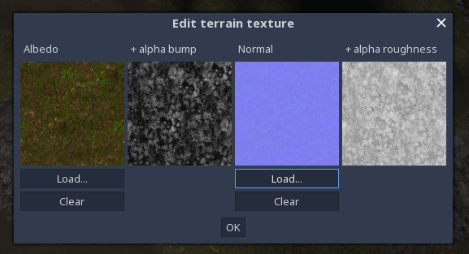

This opens a window that lets you choose two main textures: albedo an normals. Note: if you use the `Classic4Lite` shader, you don't have to setup normals. For now, you can assign the albedo texture, and the normalmap if you have one, then click `Ok`.

The default slot covers the whole terrain by default, because the splatmap is initialized with a red color `(1, 0, 0, 0)`. You can setup other textures in the other slots, so they will layer on top of the others.
Painting is very similar to scultping, because it's still editing an image in the end. You can also choose the opacity, size and shape of the brush.

### Setting up bump, normals and roughness

The ground shader provided by the plugin should work fine with only regular albedo and normal maps, but it supports a few features to make the ground look more realistic. It takes a particular approach to achieve that result. The main reason is that the classic splatmap approach requires sampling 4 textures at once. If we want normalmaps, it becomes 8, and if we want roughness it becomes 12, which is already a lot, in addition to internal textures Godot uses in the background. Not all GPUs allow that many textures in the shader, so a better approach is to combine them as much as possible into single images. This reduces the number of texture units, and reduces the number of fetches to do in the pixel shader.

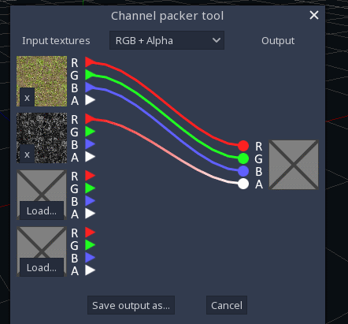

For this reason, the plugin requires bumpmaps to be merged in the alpha channel of the albedo texture. Similarly, roughness must also be defined in the alpha channel of the normalmap texture. This operation can be done in an image editing program such as Gimp, or with a Godot plugin such as Channel Packer (available on the asset library: https://godotengine.org/asset-library/asset/230). When you set those textures in the slots you saw in the previous section, the alpha channels will appear as a preview.

Bump holds a particular usage in this plugin:
You may have noticed that when you paint multiple textures, the terrain blends them together to produce smooth transitions. Usually, a classic way is to do a "transparency" transition using the splatmap. However, this rarely gives realistic visuals, so an option is to enable `depth blending`.

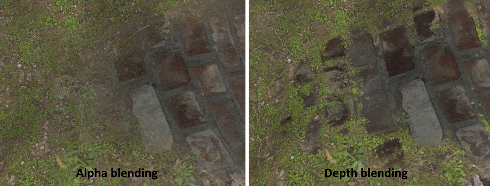

This feature changes the way blending operates by taking the bump of the ground textures into account. For example, if you have sand blending with pebbles, at the transition you will see sand infiltrate between the pebbles because the pixels between pebbles have lower bump than the pebbles. You can see this technique illustrated in this article: TODO Gamasutra link
This technique works best with fairly low brush opacity, around 10%.


### Triplanar mapping

As you saw in previous topics, making cliffs with a heightmap terrain is not recommended, because it stretches the geometry too much and makes textures look bad. Nevertheless, you can enable triplanar mapping on such texture in order for it to not look stretched. This option is in the shader section in the inspector.

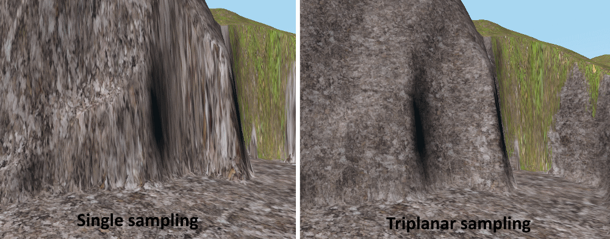

Cliffs usually are made of the same ground texture, so it is only available for textures setup in the 4th slot, called `cliff`. It could be made to work on all slots, however it involves modifying the shader to add more options, which you may see in a later article.


### Color tint

You can color the terrain using the `Color` brush. This is pretty much modulating the albedo, which can help adding a touch of variety to the landscape. If you make custom shader tweaks, color can also be used for your own purpose if you need to.

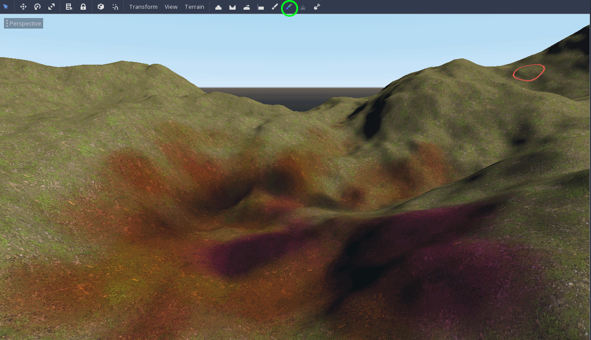


Holes
-------

It is possible to cut holes in the terrain by using the `Holes` brush. Use it with `draw holes` checked to cut them, and uncheck it to erase them. This can be useful if you want to embed a cave mesh or a well on the ground. You can still use the brush because holes are also a texture covering the whole terrain, and the ground shader will basically discard pixels that are over an area where pixels have a value of zero.

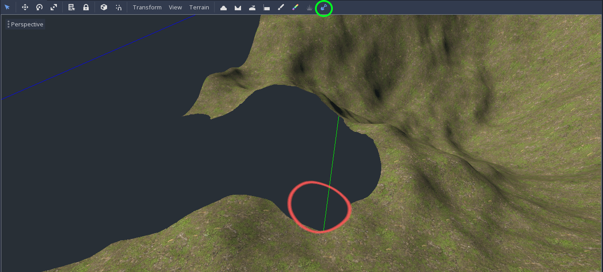

Note: this brush only produces holes visually. In order to have holes in the collider too, you have to do some tricks with collision layers because the collision shape this plugin uses (Bullet heightfield) cannot have holes. It might be added in the future, because it can be done by editing the C++ code and drop collision triangles in the main heightmap collision routine.


Terrain generator
-------------------

Basic sculpting tools can be useful to get started or tweaking, but it's cumbersome to make a whole terrain only using them. For larger scale terrain modeling, procedural techniques are often preferred, and then adjusted later on.

This plugin provides a simple procedural generator. To open it, click on the `HTerrain` node to see the `Terrain` menu, in which you select `generate...`. Note that you should have a properly setup terrain node before you can use it.

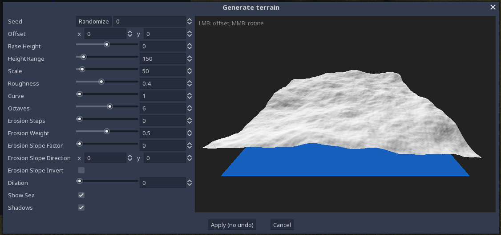

The generator is quite simple and combines a few common techniques to produce a heightmap. You can see a 3D preview which can be zoomed in with the mouse wheel and rotated by dragging holding middle click.

### Height range

`height range` and `base height` define which is the minimum and maximum heights of the terrain. The result might not be exactly reaching these boundaries, but it is useful to determine in which region the generator has to work in.

### Perlin noise

Perlin noise is very common in terrain generation, and this one is no exception. Multiple octaves (or layers) of noise are added together at varying strength, forming a good base that already looks like a good environment.

The usual parameters are available:

- `seed`: this chooses the random seed the perlin noise will be based on. Same number gives the same landscape.
- `offset`: this chooses where in the landscape the terrain will be cropped into. You can also change that setting by panning the preview with the right mouse button held.
- `scale`: expands or shrinks the length of the patterns. Higher scale gives lower-frequency relief.
- `octaves`: how many layers of noise to use. The more octaves, the more details there will be.
- `roughness`: this controls the strength of each octave relatively to the previous. The more you increase it, the more rough the terrain will be, as high-frequency octaves get a higher weight.

Try to tweak each of them to get an idea of how they affect the final shape.

### Erosion

The generator features morphological erosion. Behind this barbaric name hides a simple image processing algorithm, ).
In the context of terrains, what it does is to quickly fake real-life erosion, where rocks might slide along the slopes of the mountains over time, giving them a particular appearance. Perlin noise alone is nice, but with erosion it makes the result look much more realistic.


It's also possible to use dilation, which gives a mesa-like appearance.


There is also a slope direction parameter, this one is experimental but it has a tendency to simulate wind, kind of "pushing" the ground in the specified direction. It can be tricky to find a good value for this one but I left it because it can give interesting results, like sand-like ripples, which are an emergent behavior.


Note: contrary to previous options, erosion is calculated over a bunch of shader passes. In Godot 3, it is only possible to wait for one frame to be rendered every 16 milliseconds, so the more erosion steps you have, the slower the preview will be. In the future it would be nice if Godot allowed multiple frames to be rendered on demand so the full power of the GPU could be used.

### Applying

Once you are happy with the result, you can click "Apply", which will calculate the generated terrain at full scale on your scene. Note that this operation currently can't be undone, so if you want to go back you should make a backup.


Import an existing terrain
-----------------------------

Besides using built-in tools to make your landscape, it can be convenient to import an existing one, which you might have made in specialized software such as WorldMachine, Scape or Lithosphere.

To do this, select the `HTerrain` node, click on the `Terrain` menu and chose `Import`.
This window allows you to import several kinds of data, such as heightmap but also splatmap or color map.

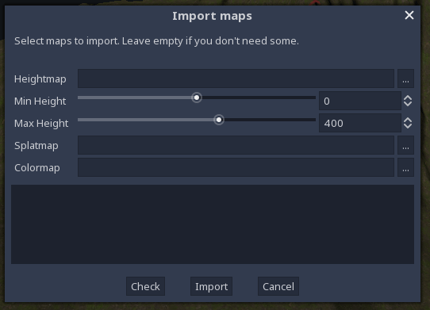

There are a few things to check before you can successfully import a terrain though:

- The resolution should be power of two + 1, and square. If it isn't, the plugin will attempt to crop it, which might be OK or not if you can deal with map borders that this will produce.
- If you import a RAW heightmap, it has to be encoded using 16-bit unsigned integer format.
- If you import a PNG heightmap, Godot can only load it as 8-bit depth, so it is not recommended for high-range terrains because it doesn't have enough height precision.

This feature also can't be undone when executed, as all terrain data will be overwritten with the new one. If anything isn't correct, the tool will warn you before to prevent data loss.

It is possible that the height range you specify doesn't works out that well after you see the result, so for now it is possible to just re-open the importer window, change the height scale and apply again.


Detail layers
---------------

Once you have textured ground, you may want to add small detail objects to it, such as grass and small rocks. Currently the plugin only support grass-like painting by scattering textured quads over the terrain, but support for actual meshes may come in the future.

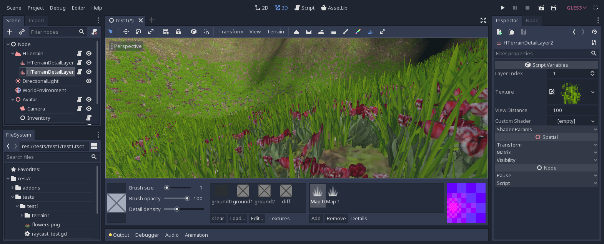

Grass is supported throught `HTerrainDetailLayer` node. They can be created as children of the `HTerrain` node. Each layer represents one kind of detail, so you may have one layer for grass, and another for flowers, for example.
Each layer allocates a 8-bit map over the whole terrain where each pixel tells how much density of that layer there is. Because of this technique, you can paint details just like you paint anything else, using the same brush system. It uses opacity to either add more density, or act as an eraser with an opacity of zero.

You can choose which texture will be used, and it will be rendered using alpha-scissor. It is done that way because it allows drawing grass in the opaque render pass, which is cheaper than treating every single quad like a transparent object which would have to be depth-sorted to render properly, especially on low-end GPUs.

Like the ground, detail layers use a custom shaders that takes advantage of the heightmap to displace each instanced object at a proper position. Also, hardware instancing is used under the hood to allow for a very high number of items with low cost. Multimeshes are generated in chunks, and then instances are hidden from the vertex shader depending on density. For grass, it also uses the normal of the ground so there is no need to provide it. There are also shader options to tint objects with the global map, which can help a lot making grass to blend better with the environment.

Detail layers are one of the newest features of the plugin so there is room for improvements in the future, like supporting meshes, multiple grass variants in the same layer using atlases, or alpha to coverage for better fading in the distance (which would need engine features).


Global map
-------------

For shading purposes, it can be useful to bake a global map of the terrain. A global map basically takes the average albedo of the ground all over the terrain, which allows other elements of the scene to use that without having to recompute the full blending process that the ground shader goes through. The current use cases for a global map is to tint grass, and use it as a distance fade in order to hide texture tiling in the very far distance. Together with the terrain's normal map it could also be used to make minimap previews.

To bake a global map, select the `HTerrain` node, go to the `Terrain` menu and click `Bake global map`. This will produce a texture in the terrain data directory which will be used by the default shaders automatically, depending on your settings.


Level of detail
-----------------

This terrain supports level of details on the geometry using a quad tree. It is divided in chunks of 32x32 (or 16x16 depending on your settings), which can be scaled by a power of two depending on the distance from the camera. If a group of 4 chunks are far enough, they will join into a single one. If a chunk is close enough, it will split in 4 smaller ones. Having chunks also improves culling because if you had a single big mesh for the whole terrain, that would be a lot of vertices for the GPU to go through.
Care is also taken to make sure transitions between LODs are seamless, so if you toggle wireframe rendering in the editor you can see variants of the same meshes being used depending on which LOD their neighbors are using.

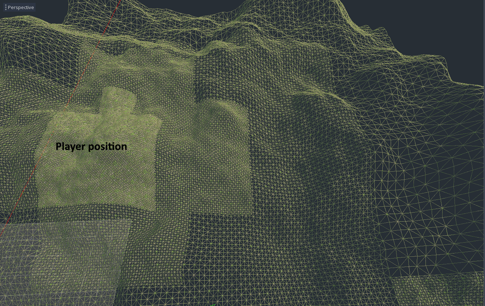

LOD can be mainly tweaked in two ways:

- `lod scale`: this is a factor determining at which distance chunks will split or join. The higher it is, the more details there will be, but the slower the game will be. The lower it is, the faster quality will decrease over distance, but will increase speed.
- `chunk size`: this is the base size of a chunk. There aren't many values that it can be, and it has a similar relation as `lod scale`. The difference is, it affects how many geometry instances will need to be culled and drawn, so higher values will actually reduce the number of draw calls. But if it's too big, it will take more memory due to all chunk variants that are precalculated.

In the future, this technique could be improved by using GPU tessellation, once the Godot rendering engine supports it.

Note: due to limitations of the Godot renderer's scripting API, LOD only works around one main camera, so it's not possible to have two cameras with split-screen for example. Also, in the editor, LOD only works while the `HTerrain` node is selected, because it's the only time the EditorPlugin is able to obtain camera information (but it should work regardless when you launch the game).


Custom shaders
-----------------

This plugin comes with default shaders, but you are allowed to modify them and change things to match your needs. The plugin does not expose materials directly because it needs to set built-in parameters that are always necessary, and some of them cannot be properly saved as material properties, if at all. It's a bit like Godot shaders being themselves sub-sets of GLSL compiled internally, but here we had to use the same shading language. In addition, the plugin might possibly need to use multiple material instances in the future instead of just one, for LOD purposes.

### Ground shaders

In order to write your own ground shader, select the `HTerrain` node, and change the shader type to `Custom`. Then, select the `custom shader` property and choose `New Shader`. This will create a new shader which is pre-filled with the same source code as the last built-in shader you had selected. Doing it this way can help seeing how every feature is done and find your own way into implementing customizations.

The plugin is setting several `uniform` parameter names which will be set to values specific to the plugin:

- `u_terrain_heightmap`: the heightmap, a half-precision float texture which can be sampled in the red channel. Like the other following maps, you have to access it using cell coordinates, which can be computed as seen in the built-in shader.
- `u_terrain_normalmap`: the precalculated normalmap of the terrain, which you can use instead of computing it from the heightmap
- `u_terrain_colormap`: the color map, which is the one modified by the color brush
- `u_terrain_splatmap`: the classic splatmap, where each channel determines the weight of a given texture. The sum of each channel should be 1.0.
- `u_terrain_globalmap`: the global albedo map.
- `u_terrain_inverse_transform`: a 4x4 matrix containing the inverse transform of the terrain. This is useful if you need to calculate the position of the current vertex in world coordinates in the vertex shader, as seen in the builtin shader.
- `u_terrain_normal_basis`: a 3x3 matrix containing the basis used for transforming normals. It is not always needed, but if you use `map scale` it is required to keep them correct.

- `u_ground_albedo_bump_0` to `3`: these are up to 4 albedo textures for the ground, which you have to blend using the splatmap. Their alpha channel can contain bump.
- `u_ground_normal_roughness_0` to `3`: similar to albedo, these are up to 4 normal textures to blend using the splatmap. Their alpha channel can contain roughness.

You don't have to declare them all. It's fine if you omit some of them, which is good because it frees a slot in the limited amount of `uniforms`, especially for texture units.
Other parameters are not used by the plugin, and are shown procedurally under the `Shader params` section of the `HTerrain` node.


### Grass shaders

Detail layers follow the same design as ground shaders. In order to make your own, select the `custom shader` property and assign it a new empty shader. This will also fork the built-in shader, which at the moment is specialized into rendering grass quads.

They share the following parameters with ground shaders:

- `u_terrain_heightmap`
- `u_terrain_normalmap`
- `u_terrain_globalmap`
- `u_terrain_inverse_transform`

And there also have specific parameters which you can use:

- `u_terrain_detailmap`: this one contains the grass density, from 0 to 1. Depending on this, you may hide instances by outputting degenerate triangles, or let them pass through. The builtin shader contains an example.
- `u_albedo_alpha`: this is the texture applied to the quad, typically transparent grass.
- `u_view_distance`: how far details are supposed to render. Beyond this range, the plugin will cull chunks away, so it is a good idea to use this in the shader to smoothly fade pixels in the distance to hide this process.
- `u_ambient_wind`: combined `vec2` parameter for ambient wind. `x` is the amplitude, and `y` is a time value. It is better to use it instead of directly `TIME` because it allows to animate speed without causing stutters.


Procedural generation from a script
-------------------------------------

It is possible to create the terrain entirely from script. It may be quite slow if you don't take advantage of GPU techniques (such as using a compute viewport), but it's still useful to copy results to the terrain or editing it like the plugin does in the editor.

Here is a full GDScript example generating a terrain from noise and 3 textures:

```gdscript
extends Node

# Import classes
const HTerrain = preload("res://addons/zylann.hterrain/hterrain.gd")
const HTerrainData = preload("res://addons/zylann.hterrain/hterrain_data.gd")

# You may want to change paths to your own textures
var grass_texture = load("res://addons/zylann.hterrain_demo/textures/ground/grass_albedo_bump.png")
var sand_texture = load("res://addons/zylann.hterrain_demo/textures/ground/sand_albedo_bump.png")
var leaves_texture = load("res://addons/zylann.hterrain_demo/textures/ground/leaves_albedo_bump.png")

func _ready():

	# Create terrain resource and give it a size.
	# It must be either 513, 1025, 2049 or 4097.
	var terrain_data = HTerrainData.new()
	terrain_data.resize(513)
	
	var noise = OpenSimplexNoise.new()
	var noise_multiplier = 50.0

	# Get access to terrain maps you want to modify
	var heightmap: Image = terrain_data.get_image(HTerrainData.CHANNEL_HEIGHT)
	var normalmap: Image = terrain_data.get_image(HTerrainData.CHANNEL_NORMAL)
	var splatmap: Image = terrain_data.get_image(HTerrainData.CHANNEL_SPLAT)
	
	heightmap.lock()
	normalmap.lock()
	splatmap.lock()
	
	# Generate terrain maps
	# Note: this is an example with some arbitrary formulas,
	# you may want to come up with your own
	for z in heightmap.get_height():
		for x in heightmap.get_width():
			
			# Generate height
			var h = noise_multiplier * noise.get_noise_2d(x, z)
			
			# Getting normal by generating extra heights directly from noise,
			# so map borders won't have seams in case you stitch them
			var h_right = noise_multiplier * noise.get_noise_2d(x + 0.1, z)
			var h_forward = noise_multiplier * noise.get_noise_2d(x, z + 0.1)
			var normal = Vector3(h - h_right, 0.1, h_forward - h).normalized()
			
			# Generate texture amounts
			# Note: the red channel is 1 by default
			var splat = splatmap.get_pixel(x, z)
			var slope = 4.0 * normal.dot(Vector3.UP) - 2.0
			# Sand on the slopes
			var sand_amount = clamp(1.0 - slope, 0.0, 1.0)
			# Leaves below sea level
			var leaves_amount = clamp(0.0 - h, 0.0, 1.0)
			splat = splat.linear_interpolate(Color(0,1,0,0), sand_amount)
			splat = splat.linear_interpolate(Color(0,0,1,0), leaves_amount)

			heightmap.set_pixel(x, z, Color(h, 0, 0))
			normalmap.set_pixel(x, z, pack_normal(normal))
			splatmap.set_pixel(x, z, splat)
	
	heightmap.unlock()
	normalmap.unlock()
	splatmap.unlock()
	
	# Commit modifications so they get uploaded to the graphics card
	var modified_region = Rect2(Vector2(), heightmap.get_size())
	terrain_data.notify_region_change(modified_region, HTerrainData.CHANNEL_HEIGHT)
	terrain_data.notify_region_change(modified_region, HTerrainData.CHANNEL_NORMAL)
	terrain_data.notify_region_change(modified_region, HTerrainData.CHANNEL_SPLAT)

	# Create terrain node
	var terrain = HTerrain.new()
	terrain.set_shader_type(HTerrain.SHADER_SIMPLE4_LITE)
	terrain.set_data(terrain_data)
	terrain.set_ground_texture(0, HTerrain.GROUND_ALBEDO_BUMP, grass_texture)
	terrain.set_ground_texture(1, HTerrain.GROUND_ALBEDO_BUMP, sand_texture)
	terrain.set_ground_texture(2, HTerrain.GROUND_ALBEDO_BUMP, leaves_texture)
	add_child(terrain)
	
	# No need to call this, but you may need to if you edit the terrain later on
	#terrain.update_collider()


static func pack_normal(v):
	v = 0.5 * (v + Vector3(1,1,1))
	return Color(v.x, v.z, v.y)
```
